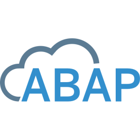

# Gleilson Alves de Oliveira
Sou formado em análise e desenvolvimento de sistemas pelo centro universitário Estácio de Sá. Comecei a carreira na T.I como suporte técnico N1, e hoje, estou com mais de 5 anos como desenvolvedor ABAP, e já estou atuando como sênior step 1 em desenvolvimento SAP ABAP. <br>

Aqui você vai encontrar muito código, não só ABAP, mas também JS, React, React Native e etc.<br>

<b>💾 I'm a Software Developer 💾</b><br><br>

## 💻 Linguagens

<br>
<br>
<br><br>


<br><br>

<br>

## 💻 Onde me encontrar

| Contato | Links |
|-------|---------|
|LinkedIn | [](https://www.linkedin.com/in/gleilsonalves/)
| YouTube | [](https://www.youtube.com/@gleilsonalves)
| Instagram | [](https://www.instagram.com/gleilsonalves)

```
     Gosto muito de tecnologia, programação e solução de problemas.
     Sou entusiasta de inovações, e essa área de ajuda a acompanhar a evolução do mundo, bem como me da a oportunidade de fazer parte dessa evolução.
```

